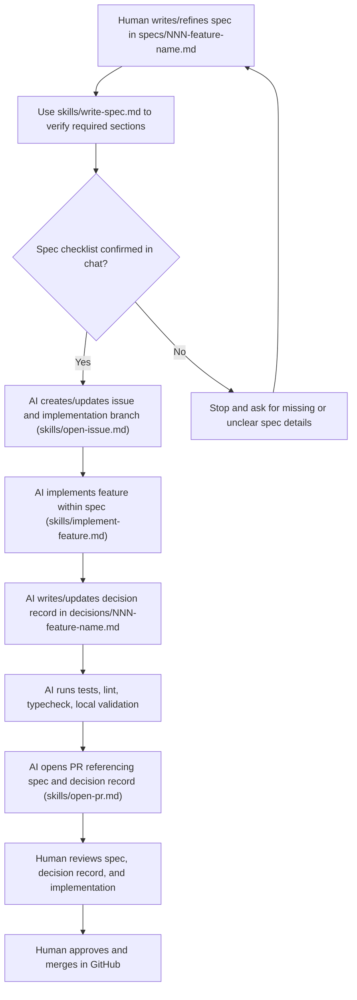

# Footy Trends

Footy Trends is a Next.js app for football trend analysis (Champions League and
top 5 leagues) with a production-oriented setup: strict TypeScript, Drizzle,
Postgres, Redis cache, CI, Sentry, and Railway config as code.

---

## Quick Start

```bash
cp .env.example .env
npm install
docker compose up -d
npm run db:migrate
npm run dev
```

App runs at: http://localhost:3000

If you are starting a feature, write a spec in `specs/NNN-feature-name.md` first and confirm the checklist in chat before implementation.

---

## Project Overview

### Current Capabilities

- Next.js App Router baseline with strict TypeScript
- Database access via Drizzle + Postgres
- Redis cache utilities
- Health endpoint at `/api/health` (database + redis checks)
- Error monitoring via Sentry
- Structured backend logging with Pino (Axiom transport when configured)
- CI workflows for typecheck, lint, tests, and SonarCloud scan

---

## Getting Started

### Prerequisites

- Node.js 24+
- npm 12.0.1
- Docker (for local Postgres)
- Local `.env` file based on `.env.example`

### Environment Variables

Defined in `.env.example`.

Key variables:

- `DATABASE_URL` - Postgres connection string
- `REDIS_URL` - Redis connection string
- `FOOTBALL_DATA_API_KEY` - football-data.org API key
- `NEXT_PUBLIC_SENTRY_DSN` - Sentry client DSN
- `AXIOM_TOKEN` and `AXIOM_DATASET` - Axiom log ingest
- `LOG_LEVEL` - Pino log level (`info`, `debug`, etc.)

---

## Architecture

### High-Level Overview

- Frontend and backend: Next.js App Router
- API layer: route handlers in `src/app/api`
- Database: PostgreSQL with Drizzle ORM
- Cache: Redis (`ioredis`)
- Observability: Sentry + Pino with optional Axiom transport
- Deployment: Railway with `railway.toml`

### Key Directories

- `src/app` - pages, layouts, and route handlers
- `src/app/api` - API endpoints
- `src/db` - database client, schema, migrations runner
- `src/lib` - shared utilities (cache, redis, logger)
- `docs/setup` - step-by-step infrastructure setup docs

---

## Development

### Run Checks

```bash
npm run typecheck
npm run lint
npm test
```

### Test Layout

Tests are organized by test type, with unit tests mirroring the relevant
`src/` paths:

- `tests/unit/` - isolated unit tests, run with `npm run test:unit`
- `tests/integration/` - tests spanning multiple application boundaries, run
   with `npm run test:integration`
- `tests/e2e/` - end-to-end tests against the running application, run with
   `npm run test:e2e`

CI runs the unit test suite with coverage. Integration and end-to-end suites
have separate commands so they can be enabled with their required services and
runtime setup without changing the unit-test workflow.

### Database Workflows

```bash
npm run db:generate
npm run db:migrate
```

Alternative for local-only schema sync:

```bash
npm run db:push
```

### Railway Deploy Config

`railway.toml` controls:

- pre-deploy migration command
- start command
- health check path and timeout
- restart policy
- deploy watch patterns

### Human Contributor Workflow

For day-to-day development, follow this sequence:



1. Write or update a feature spec in `specs/NNN-feature-name.md` before coding.
2. Use `skills/write-spec.md` to check that the spec covers the required sections.
3. Confirm the spec checklist in chat before implementation begins.
4. Let the AI proceed autonomously from there: create or update the GitHub issue,
   create the implementation branch, implement the feature, write the decision
   record, run the checks, and prepare the PR.
5. Review the AI-written decision record in `decisions/NNN-feature-name.md`
   while the work is in progress.
6. Add or update tests, then run `npm run typecheck`, `npm run lint`, and
   `npm test`.
7. Let the AI open a PR using `skills/open-pr.md`, reference the spec and
   decisions file, link the issue, and prepare it for review.
8. Respond to review feedback, make any required changes, and only merge after
   the branch is approved.

### What the AI should do

When working with this repository, the AI assistant should:

- follow the spec-first workflow and stop if the spec is incomplete
- use the repository rules in `CLAUDE.md`, `skills/write-spec.md`,
  `skills/open-issue.md`, `skills/implement-feature.md`, and
  `skills/open-pr.md`
- help draft or refine specs, decision records, tests, and PR descriptions
- implement the feature autonomously within the bounds of the approved spec
- carry out routine workflow steps without repeated handholding, including
  issue creation, branching, testing, and PR preparation
- verify changes with the relevant checks before suggesting completion
- keep user-facing UI strings in Finnish and other repo text in English

### What humans should do

Humans remain responsible for:

- deciding the product direction and acceptance criteria
- validating that the spec is complete enough for implementation
- reviewing the AI-written plan and decision record
- approving the final implementation and merge decision in GitHub
- reviewing PRs and responding to feedback
- handling repository access, branch protection, and release choices

---

## Repository Guidelines

- Use branch names that describe intent (example: `chore/npm-ci-and-logging`)
- Keep commits focused and imperative (example: `chore: pin npm in CI`)
- Keep infrastructure setup docs in `docs/setup` as source of truth

---

## Continuous Integration

GitHub Actions workflows in `.github/workflows`:

- `ci.yml`: typecheck, lint, test
- `sonarcloud.yml`: test with coverage + SonarCloud scan

Both workflows target Node 24, and the project expects npm 12.0.1.

---

## Documentation

- Setup sequence: `docs/setup/README.md`
- Key setup topics include database, Redis, Sentry, Axiom, CI, and Railway

---

## Notes

- This repository is still in foundational setup mode; many feature specs live
	in `specs/` and are not implemented yet.
