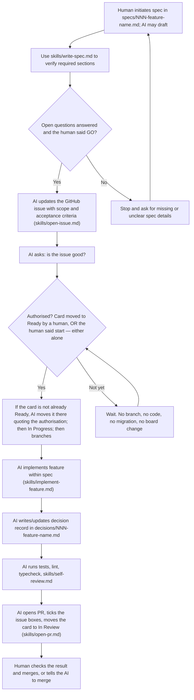

# Footy Trends

Footy Trends is a Next.js app for football trend analysis (Champions League and
top 5 leagues) with a production-oriented setup: strict TypeScript, Drizzle,
Postgres, Redis cache, CI, Sentry, and Railway config as code.

---

## Quick Start

```bash
./scripts/setup
```

One command from a fresh clone to a running app at http://localhost:3000. It
checks the prerequisites, installs the dependencies, writes `.env` with a
generated database password, migrates, and offers to start the dev server.

**[INSTALL.md](INSTALL.md)** has the prerequisites, the two API keys, the same
steps by hand, and troubleshooting.

If you are starting a feature, write a spec in `specs/NNN-feature-name.md` first and confirm the checklist in chat. **Only once a human says go**, update the issue and ask whether it is good — and work starts only once a human moves the card to `Ready` or tells you to start.

---

## Project Overview

### Current Capabilities

- Next.js App Router baseline with strict TypeScript
- Database access via Drizzle + Postgres
- Redis cache utilities
- Health endpoint at `/api/health` (database + redis checks)
- Error monitoring via Sentry
- Structured backend logging with Pino (Axiom transport when configured)
- CI workflows for typecheck, lint, tests, and SonarCloud scan

---

## Architecture

### High-Level Overview

- Frontend and backend: Next.js App Router
- API layer: route handlers in `src/app/api`
- Database: PostgreSQL with Drizzle ORM
- Cache: Redis (`ioredis`)
- Observability: Sentry + Pino with optional Axiom transport
- Deployment: Railway with `railway.toml`

### Key Directories

- `src/app` - pages, layouts, and route handlers
- `src/app/api` - API endpoints
- `src/db` - database client, schema, migrations runner
- `src/lib` - shared utilities (cache, redis, logger)
- `docs/setup` - step-by-step infrastructure setup docs

### Competitions and standings

The home page (`/`) is a competition picker; each competition's standings
live at `/sarjataulukko?kilpailu={code}`. `src/lib/competitions.ts` lists
the supported competitions — currently the 9 plain league-table
competitions our football-data.org plan grants access to (Premier League
and 8 others; cup/knockout competitions and other providers are out of
scope, see `specs/006-other-competitions.md`).

Standings resolve server-side per competition and season. The app reads
calculated standings from Redis first, then normalized finished matches
from PostgreSQL, and refreshes from football-data.org when local data is
missing or older than `FOOTBALL_DATA_REFRESH_INTERVAL_SECONDS`. Provider
responses use separate Redis TTLs, keyed per competition: one hour for
competition metadata and 15 minutes for finished matches. The provider API
key is never sent to the browser.

### Test Layout

Tests are organized by test type, with unit tests mirroring the relevant
`src/` paths:

- `tests/unit/` - isolated unit tests, run with `npm run test:unit`
- `tests/integration/` - tests spanning multiple application boundaries, run
   with `npm run test:integration`
- `tests/e2e/` - Playwright end-to-end tests against a real running
   application, run with `npm run test:e2e` (see `tests/e2e/README.md` for
   prerequisites)

CI runs the unit test suite with coverage and the integration suite, the
latter against Postgres/Redis service containers it provisions itself. The
end-to-end suite has a separate command so it can be enabled with its
required runtime setup without changing the CI workflow.

### Railway Deploy Config

`railway.toml` controls:

- pre-deploy migration command
- start command
- health check path and timeout
- restart policy
- deploy watch patterns

---

## How we work

`CLAUDE.md` is the authoritative description: a spec, a human **go**, an issue,
a human authorising the start, then implementation, a pull request, and a human
merge. The three points where a human decides are agreeing the work,
authorising the start, and merging.



A chore follows `skills/chore-workflow.md` and a bug `skills/bug-workflow.md`;
neither has a spec or a decision record.

---

## Repository Guidelines

- Use branch names that describe intent (example: `chore/npm-ci-and-logging`)
- Keep commits focused and imperative (example: `chore: pin npm in CI`)
- Keep infrastructure setup docs in `docs/setup` as source of truth

---

## Continuous Integration

GitHub Actions workflows in `.github/workflows`:

- `ci.yml`: typecheck, lint, unit test, integration test
- `sonarcloud.yml`: test with coverage + SonarCloud scan

Both workflows target Node 24, and the project expects npm 12.0.2.

---

## Documentation

- Installing and running locally: `INSTALL.md`
- Setup sequence: `docs/setup/README.md`
- Key setup topics include database, Redis, Sentry, Axiom, CI, and Railway

---

## Notes

- This repository is still in foundational setup mode; many feature specs live
	in `specs/` and are not implemented yet.
