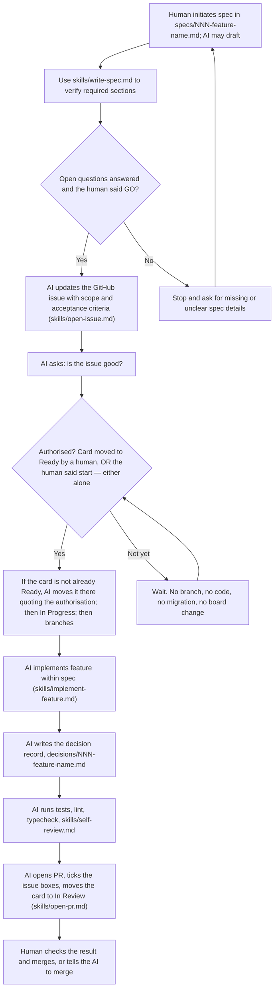

# Footy Trends

A Finnish-language football trends site. Standings, matches, team pages and
trend charts for three regions, and predictions for upcoming matches:

| Region | Covers | Data from |
|---|---|---|
| `Kotimaa` | Finnish leagues and cups | Palloliitto's TASO |
| `Ulkomaat` | the Champions League and European and other top leagues | football-data.org |
| `Maajoukkueet` | tournaments, and Finland's national teams | both |

Next.js, strict TypeScript, Drizzle on Postgres, a Redis cache, deployed on
Railway. Every user-facing string is Finnish; code, comments and documents are
English.

---

## Quick Start

```bash
./scripts/setup
```

One command from a fresh clone to a running app at http://localhost:3000. It
checks the prerequisites, installs the dependencies, writes `.env` with a
generated database password, migrates, and offers to start the dev server.

**[INSTALL.md](INSTALL.md)** has the prerequisites, the two API keys, the same
steps by hand, and troubleshooting.

If you are starting a feature, write a spec in `specs/NNN-feature-name.md` first and confirm the checklist in chat. **Only once a human says go**, update the issue and ask whether it is good — and work starts only once a human moves the card to `Ready` or tells you to start.

---

## Architecture

- **Frontend and backend:** Next.js App Router. Finnish URLs (`/kotimaa`,
  `/ulkomaat/sarjataulukko`) are rewrites in `next.config.ts` onto English
  route folders in `src/app`.
- **Data:** provider responses are cached in Redis and finished matches stored
  in Postgres; a page reads stored data and refreshes from the provider only
  when it is missing or stale. No provider is called on every page load, and
  no provider key reaches the browser.
- **Analytics and predictions** are computed from stored matches. They are for
  signed-in readers (Google sign-in through better-auth).
- **Predictions** are logged hourly by a cron service and judged against the
  results.

### Key directories

- `src/app` — pages, layouts and route handlers
- `src/lib` — data services, the cache, the models, shared utilities
- `src/db` — the database client and schema; migrations in `drizzle/`
- `specs/`, `decisions/` — what each feature is, and how it was built
- `skills/` — the workflows `CLAUDE.md` refers to
- `docs/infrastructure.md` — **how the running system is set up now**
- `docs/setup/` — standing the infrastructure up from zero

### Test Layout

Tests are organized by test type, with unit tests mirroring the relevant
`src/` paths:

- `tests/unit/` - isolated unit tests, run with `npm run test:unit`
- `tests/integration/` - tests spanning multiple application boundaries, run
   with `npm run test:integration`
- `tests/e2e/` - Playwright end-to-end tests against a real running
   application, run with `npm run test:e2e` (see `tests/e2e/README.md` for
   prerequisites)

`npm run verify` runs every stage the gate does, in order. On a pull request
CI runs the unit and integration suites; the end-to-end suite runs locally
(the pre-push hook asks for a fresh run) and in `release.yml`, against a
production build, before anything reaches production.

The project targets Node 24, and expects npm 12.2.0.

---

## How we work

`CLAUDE.md` is the authoritative description: a spec, a human **go**, an issue,
a human authorising the start, then implementation, a pull request, and a human
merge. The three points where a human decides are agreeing the work,
authorising the start, and merging.


```mermaid
flowchart TD
  Human_spec["Human initiates spec in specs/NNN-feature-name.md; AI may draft"]
  Spec_checklist["Use skills/write-spec.md to verify required sections"]
  Spec_confirmed{"Open questions answered and the human said GO?"}
  AI_issue["AI updates the GitHub issue with scope and acceptance criteria (skills/open-issue.md)"]
  AI_asks["AI asks: is the issue good?"]
  Human_ready{"Authorised? Card moved to Ready by a human, OR the human said start — either alone"}
  AI_branch["If the card is not already Ready, AI moves it there quoting the authorisation; then In Progress; then branches"]
  AI_implement["AI implements feature within spec (skills/implement-feature.md)"]
  AI_decision["AI writes the decision record, decisions/NNN-feature-name.md"]
  AI_checks["AI runs tests, lint, typecheck, skills/self-review.md"]
  AI_open_pr["AI opens PR, ticks the issue boxes, moves the card to In Review (skills/open-pr.md)"]
  Human_merge["Human checks the result and merges, or tells the AI to merge"]
  Ask_for_info["Stop and ask for missing or unclear spec details"]
  Wait["Wait. No branch, no code, no migration, no board change"]

  Human_spec --> Spec_checklist --> Spec_confirmed
  Spec_confirmed -->|Yes| AI_issue --> AI_asks --> Human_ready
  Spec_confirmed -->|No| Ask_for_info --> Human_spec
  Human_ready -->|Yes| AI_branch --> AI_implement --> AI_decision --> AI_checks --> AI_open_pr --> Human_merge
  Human_ready -->|"Not yet"| Wait --> Human_ready
```

A chore follows `skills/chore-workflow.md` and a bug `skills/bug-workflow.md`;
neither has a spec, and each writes a decision record when it changes something
meaningful.

---

## Repository Guidelines

- Branches: `feature/NNN-short-name` (the spec's number), `chore/NNN-…` and
  `bug/NNN-…` (the issue's number)
- Conventional commit subjects (`feat:`, `fix:`, `chore:`, `docs:`): the
  release version and notes are derived from them
- A change to infrastructure updates `docs/infrastructure.md` in the same pull
  request

---

## Documentation

- Installing and running locally: `INSTALL.md`
- How the running system is set up, and its constraints: `docs/infrastructure.md`
- Standing the infrastructure up from zero: `docs/setup/README.md`
- How work is agreed, built and merged: `CLAUDE.md` and `skills/`
- Releasing: `skills/release.md`
